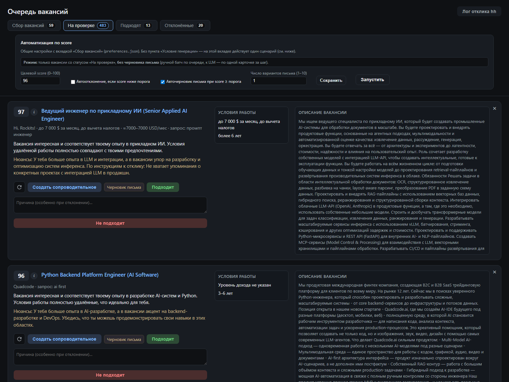
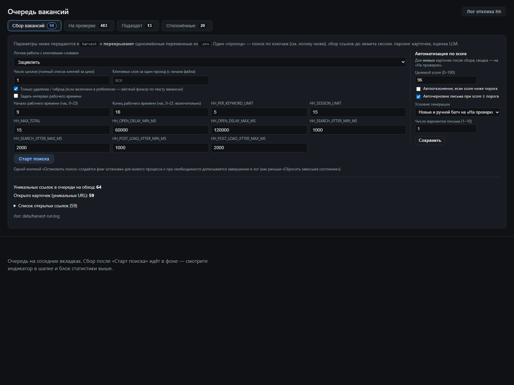
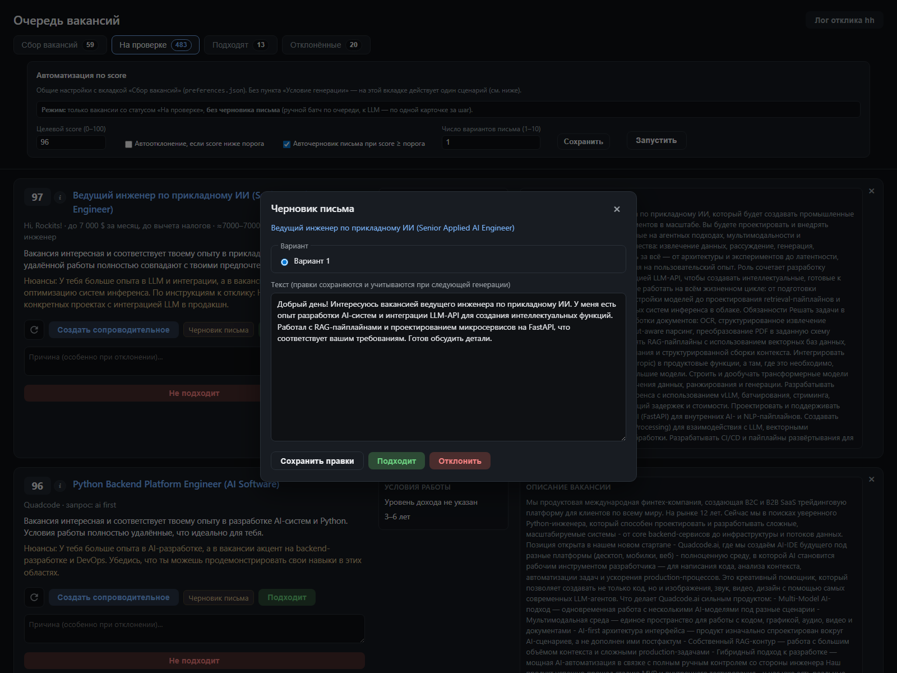
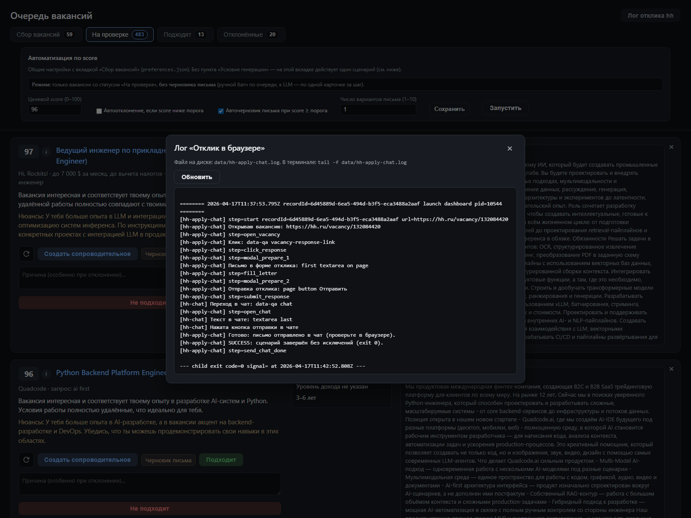
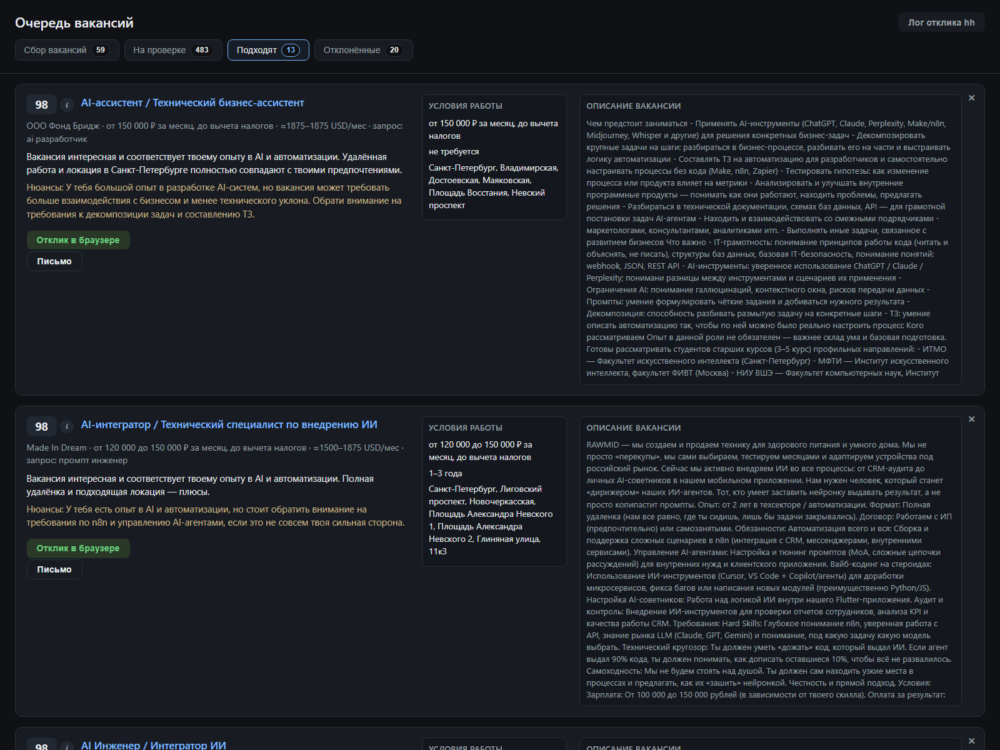

# JobRadar

`JobRadar` — портфолио-проект на `Node.js` + `Playwright`, который превращает хаотичный поиск вакансий на `hh.ru` в управляемый пайплайн: собрать позиции, оценить их через LLM, вынести в очередь, сгенерировать сопроводительное и довести отклик до браузерного шага с сохранённой сессией.

Проект не пытается полностью убрать человека из процесса. Логин на `hh.ru`, проверка письма и финальная отправка остаются под контролем пользователя, а автоматизация снимает рутину вокруг поиска, приоритизации и подготовки отклика.

## Почему это сильный pet-проект

- Веб-дашборд поверх Playwright-автоматизации, а не просто набор CLI-скриптов.
- Очередь вакансий с LLM scoring: `scoreVacancy`, `scoreCvMatch`, `scoreOverall`.
- Генерация и ручное редактирование сопроводительных писем прямо из интерфейса.
- Извлечение `employerInstructions` из текста вакансии и подмешивание их в письмо.
- Review automation по score: автоотклонение, автогенерация черновиков, батч-обработка `pending`.
- Persistent browser session: повторный логин не нужен, пока жива сохранённая сессия.
- Два сценария отклика: через форму вакансии и через чат с работодателем.

## Интерфейс

### Очередь на проверке



Очередь показывает score, детали вакансии, комментарии модели и статус обработки до отклика.

### Автоматизация сбора и review по score



Из интерфейса можно запускать `harvest`, управлять лимитами, логикой ключей, рабочими часами и автоматизацией ревью.

### Генерация и редактор черновика



Письмо генерируется на основе вакансии, CV, шаблона, стилевых примеров и дополнительных данных из `applicationProfile`.

### Лог браузерного отклика



После подтверждения сценарий запускает браузерный шаг и пишет понятный лог прямо в дашборд.

### Утверждённые действия перед откликом



После ревью карточки переходят в готовое состояние, откуда можно запускать отклик в браузере.

## Что умеет проект

- Собирать вакансии по ключам из `config/search-keywords.txt`.
- Хранить очередь в `data/vacancies-queue.json` и работать с ней через веб-интерфейс.
- Оценивать вакансии через LLM с учётом резюме из `CV/`.
- Извлекать инструкции работодателя из описания вакансии: что приложить, с чего начать ответ, на какие вопросы ответить.
- Генерировать сопроводительные письма и давать их редактировать перед утверждением.
- Подмешивать в генерацию `applicationProfile` из `config/preferences.json`: ссылки, кейсы, AI-опыт, ответы на типовые вопросы.
- Автоматизировать review по порогу score: автоотклонение слабых вакансий и автосоздание черновиков для сильных.
- Переиспользовать сохранённую браузерную сессию в `data/session`.
- Сканировать вакансии из Telegram через `npm run scan-tg`.
- Обновлять Playwright-селекторы через `npm run codegen-hh`, если `hh.ru` меняет вёрстку.

## Рабочий flow

1. `npm run login` открывает Chromium, вы вручную входите в `hh.ru`, сессия сохраняется.
2. `npm run harvest` проходит по ключам, собирает вакансии и считает LLM-скоры.
3. `npm run dashboard` поднимает интерфейс на `http://127.0.0.1:3849`, где появляется очередь.
4. На карточках видно score, описание вакансии, условия работы и извлечённые инструкции работодателя.
5. Для подходящих позиций создаётся черновик сопроводительного, который можно поправить и утвердить.
6. После утверждения запускается браузерный сценарий отклика, но финальную проверку и отправку контролирует пользователь.

## Human-in-the-loop: где остаётся человек

- Авторизация на `hh.ru` всегда ручная: проект сохраняет уже подтверждённую сессию, а не обходит логин.
- `hh-fill-letter` вставляет сопроводительное в форму отклика и останавливается на шаге проверки перед отправкой.
- `hh-apply-chat` работает через чат работодателя; для безопасной проверки есть режимы `--dry-run` и `--no-submit`.
- Генерация письма не скрывает исходные данные: перед откликом письмо можно отредактировать и утвердить в интерфейсе.

## `hh-fill-letter` vs `hh-apply-chat`

| Сценарий | Что делает |
|----------|------------|
| `npm run hh-fill-letter -- --id=<uuid>` | Открывает страницу вакансии, нажимает «Откликнуться», вставляет текст в форму и оставляет финальную проверку пользователю. |
| `npm run hh-apply-chat -- --id=<uuid>` | Идёт через чат с работодателем и поддерживает флаги для ручного контроля: `--dry-run`, `--no-submit`, `--stay-open`. |

Если нужен максимально осторожный режим, удобнее стартовать с `hh-fill-letter`. Если вакансия предполагает коммуникацию через чат, используется `hh-apply-chat`.

## Быстрый старт

```bash
git clone https://github.com/dmitryrod/jobradar.git
cd jobradar
npm install
npx playwright install chromium
npm run bootstrap
```

Дальше happy path:

```bash
npm run login
npm run harvest
npm run dashboard
```

После этого откройте `http://127.0.0.1:3849`, проверьте очередь, создайте черновик письма и запускайте браузерный отклик из интерфейса или CLI.

## Основные команды

| Команда | Назначение |
|---------|------------|
| `npm run login` | Ручной вход в `hh.ru` с сохранением persistent-сессии. |
| `npm run vacancies` | Сбор вакансий по ключам без полного пайплайна оценки. |
| `npm run harvest` | Поиск + парсинг + LLM scoring + обновление очереди. |
| `npm run dashboard` | Веб-дашборд для очереди, писем и запуска браузерных действий. |
| `npm run hh-fill-letter` | Вставка письма в форму отклика на странице вакансии. |
| `npm run hh-apply-chat` | Отклик через чат с работодателем. |
| `npm run scan-tg` | Сканирование вакансий из Telegram-каналов. |
| `npm run codegen-hh` | Перегенерация селекторов, если у `hh.ru` изменилась вёрстка. |
| `npm test` | Набор smoke/unit-тестов для ключевых частей логики. |

## Ключевые сценарии использования

### 1. Полуавтоматический поиск и отклик

Собрать новые вакансии, отранжировать их по LLM-score, вручную выбрать лучшие и довести до отправки через браузер.

### 2. Подготовка персонализированных откликов

Использовать шаблон письма, стилевые примеры, CV и `applicationProfile`, чтобы адаптировать сопроводительное под конкретную вакансию и требования работодателя.

### 3. Автоматизация review-этапа

Настроить порог score, автоотклонение и автогенерацию черновиков, чтобы дашборд сразу выделял приоритетные позиции для ручной проверки.

### 4. Работа с длинной очередью

Держать единый pipeline в `data/`: браузерная сессия, очередь вакансий, логи сбора и лог браузерного отклика.

## Конфигурация

Ключевое, что нужно настроить:

- `.env` на базе [`.env.example`](.env.example): LLM-провайдер, путь к сессии, лимиты, порт дашборда.
- `config/search-keywords.txt`: поисковые запросы.
- `CV/`: резюме в `.md`, `.txt` или `.pdf`.
- `config/cover-letter.txt`: базовый шаблон сопроводительного.
- `config/preferences.json`: веса score, `applicationProfile`, review automation.

Полный список параметров и значения по умолчанию лучше смотреть в [`.env.example`](.env.example), а не в этом README.

## Структура проекта

```text
.
├── scripts/             # CLI-скрипты: login, harvest, dashboard, отклики, codegen
├── lib/                 # Общая бизнес-логика, LLM, парсинг, селекторы и UI-логика
├── lib/dashboard/public # Статический фронтенд дашборда
├── config/              # Ключи поиска, шаблоны писем, preferences
├── CV/                  # Резюме и вспомогательные материалы пользователя
├── data/                # Очередь вакансий, логи, browser session
├── .env.example         # Пример конфигурации окружения
└── package.json
```

## Ограничения и честные границы

- Проект завязан на текущую вёрстку `hh.ru`; при изменениях могут потребоваться новые селекторы.
- Качество scoring и писем зависит от содержимого `CV/`, шаблонов и выбранной LLM.
- Без ручного логина и живой сессии браузерные сценарии не работают.
- Это не "one-click auto apply bot": финальное решение об отклике и отправке остаётся за пользователем.
- Массовые автоматизированные действия на стороннем сервисе всегда стоит использовать аккуратно и осознанно.

## Подробная документация

- [`docs/USAGE.md`](docs/USAGE.md) — полный гайд по установке, дашборду, откликам и troubleshooting.
- [`docs/DESIGN.md`](docs/DESIGN.md) — инвентаризация текущего UI и дизайн-документация для Google Stitch.
- [`docs/CHANGELOG.md`](docs/CHANGELOG.md) — заметные изменения поведения и запуска.
- [`.env.example`](.env.example) — актуальные переменные окружения и комментарии к ним.
